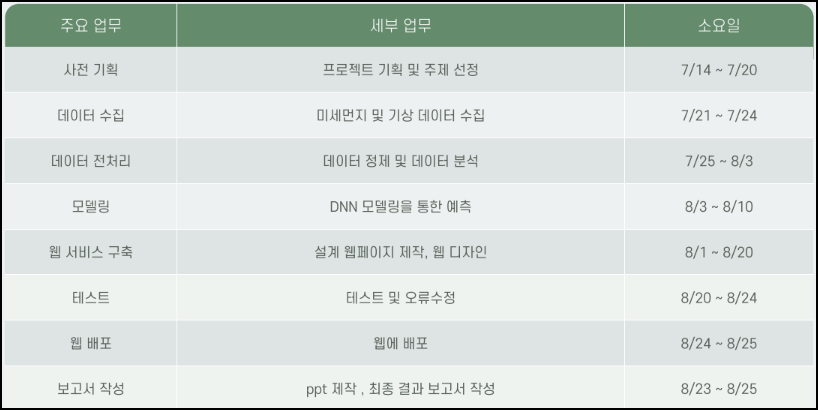

# 자전거 경로 안내와 이동 거리 동안의 미세먼지 흡입량 계산 서비스

---

- **사용 툴**
    - `Spring Boot`, `Spring Security`
    - `ORACLE`, `DBeaver`
    - `GitHub`, `Sourcetree`
    - `VScode`, `STS4`, `Colab`
    - `jQuery`, `Ajax`
- **사용 API**
    - 지도 조작 : `Kakao Maps API`
    - 경로 데이터 : `openroute service API`
    - 미세먼지 데이터 :`서울 열린데이터 광장 API`, `에어코리아 API`
- **사용 언어**
    - 데이터 분석 및 예측 : `Python`
    - 웹 개발 : `Java`, `HTML`, `CSS`, `JavaScript`
- **데이터 분석 및 예측 시 사용 라이브러리**
    - `pandas`
    - `seaborn`
    - `sklearn`, `tensorflow`
- **인원** : 5명
- **기간** : 2022.07.14 ~ 2022.08.25

## 프로젝트 목적

---

- 자전거 이용을 활성화해 신선한 공기와 도시를 만드는데 이바지할 수 있는 사이트 제작
    - 자전거 경로, 공유 자전거 대여소 정보 제공
- 사용자가 자전거 이용 여부를 판단하도록 하여 미세먼지로 부터 건강 보호
    - 미세먼지 현황 제공
    - 경로 이동 동안 예상 미세먼지 흡입량 계산 서비스 제공

## 팀원 및 역할 분담

---

- **팀원** : 전세연, 정진우, 조해성, 한희수, 황채은
- **공통 역할**
    - 아이디어 도출을 통해 프로젝트 기획 및 총괄
    - 필요한 데이터 수집
    - 프로젝트에 적용될 기능 설계서, 화면 설계서 작성
    - 기능이 올바르게 작동하는 지 테스트 수행
- **한희수 - 팀장**
    - 로그인, 회원가입, 마이페이지, 경로 찾기 페이지 등 전반적인 페이지 디자인
- **전세연**
    - 에어코리아의 미세먼지 데이터와 기상 데이터를 이용한 데이터 분석 및 예측
- **조해성**
    - `jQuery`, `Ajax`를 이용한 회원가입
    - `Spring Security`를 이용한 마이페이지 구현
- **정진우**
    - 데이터 베이스에 적용할 ERD 설계
    - `Spring Security`를 적용한 로그인 기능 구현
    - `Spring Security`의 인증을 이용한 페이지별 권한 설정
    - 화면에 지도를 보여주며, 행정구역 별 미세먼지 현황과 자전거 경로를 보여주는 기능 구현
    - 자전거 경로에 따른 미세먼지 흡입량을 계산해주는 기능 구현
- **황채은**
    - `MyBatis`를 이용한 게시판 글 등록, 수정, 삭제와 페이징 기능 구현

## 프로젝트 수행 과정

---

- **전체 수행 기간** : 2022.07.14 ~ 2022.08.25

## 데이터 흐름도

---

## 한계점

---

- **웹 개발**
    - 전국의 미세먼지 현황을 지도에 표시하지 못함
    - 회원 탈퇴, 정보 수정 기능 등이 미구현
    - 댓글 기능 미구현
    - 게시물에 사진 파일 첨부 기능 미구현
- **데이터 분석 및 예측**
    - 전국적인 범위로 하지 못함
    - 일별 데이터나 시간별 데이터가 아닌 월별 데이터를 사용

## 향후 계획

---

- 미구현된 기능들을 구현
- 지속적인 코드 관리
- 추가적인 데이터 수집을 통해 분석을 진행, 프로그램의 지역 범위를 전국적인 범위로 확장

## 결과 자료

---

- [결과 pdf](https://drive.google.com/file/d/1rprsRpCsbORXIh31heOpiuf3NFGgFiRn/view?usp=sharing)
- [시연 영상](https://drive.google.com/file/d/1FJqKpRm6rcVQP-fEumiQfTOXnc46zm5v/view?usp=sharing)

## DB, API 설정

---

### 1. DB 설정

- 파일 경로
    - **DustDefense → src → main → resources → application.properties**
- DB 주소, 사용자 이름, 비밀번호 입력
    
    
    

### 2. 구글 인증 메일 기능

- **구글 인증 메일 참고 자료**
    - [https://born2bedeveloper.tistory.com/14](https://born2bedeveloper.tistory.com/14)
- **파일 경로**
    - **DustDefense → src → main → resources → application.properties**
- **email 주소, 비밀번호 입력**
    
    
    

### 3. Kakao Maps API 키

- **API 인증키 신청**
    - [https://apis.map.kakao.com/](https://apis.map.kakao.com/)
- **파일 경로**
    - **DustDefense → src → main → resources → templates → homPage.html**
    
    
    
    - **DustDefense → src → main → resources → templates → pathfind.html**
    
    
    

### 4. 서울 공공 데이터 API

- **API 인증키 신청**
    - [https://data.seoul.go.kr/](https://data.seoul.go.kr/)
- **파일 경로**
    - **DustDefense → src → main → resources → static → js → map → kakaoMap.js**
    
    
    

### 5. openroute service API

- **API 인증키 신청**
    - [https://openrouteservice.org/](https://openrouteservice.org/)
- **파일 경로**
    - **DustDefense → src → main → resources → static → js → map → pathFind.js**
    
    
